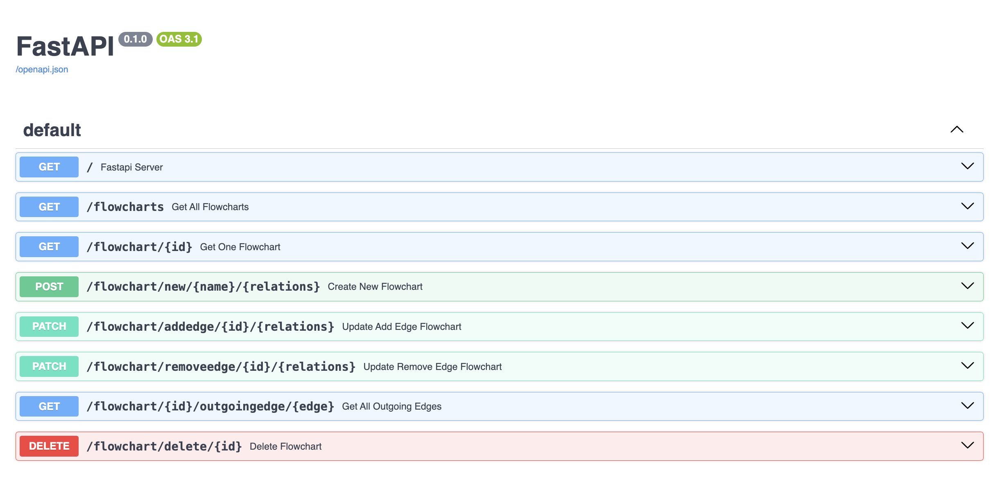

# FlowchartMaker

## Overview 
This project is about designing and implementing a system to manage flowcharts with basic CRUD operations. 
Each flowchart consists of nodes and edges that form a directed graph. 
REST APIs are used to implement the following features : 

## Technical Details
1. *Create Flowchart:* Create a new flowchart with a unique ID, nodes, and edges.
2. *Fetch Flowchart:* Fetch details of a flowchart by its ID, including its nodes and edges.
3. *Update Flowchart:* Add or remove nodes and edges in an existing flowchart.
4. *Delete Flowchart:* Delete an existing flowchart by its ID.
5. An added endpoint to fetch all outgoing edges for a given node.
6. *Basic Swagger* documentation for the APIs.

## FastAPI 
Reason for choosing FastAPI for the project : 

1. Type Checking: Utilizes Python type hints to ensure type safety and validation.
2. Automatic Documentation: Generates interactive API documentation with Swagger UI and ReDoc.
3. Performance: Built on Starlette and Pydantic, making it one of the fastest frameworks available.
4. Data Models: Uses Pydantic for data validation and serialization, ensuring consistent data models.

## Steps to run the app : 
1. Create a virtual env in python, so you don't mess with your global libraries
> python3 -m venv .venv

2. Install all the libraries in requirements.txt
> python3 install -r requirements.txt

3. Start the fastAPI server, with automatic reload flag
> uvicorn server:app --reload

4. Visit the homepage at 8000 port
http://localhost:8000

5. Visit the Swagger page for making the HTTP calls
http://localhost:8000/docs

