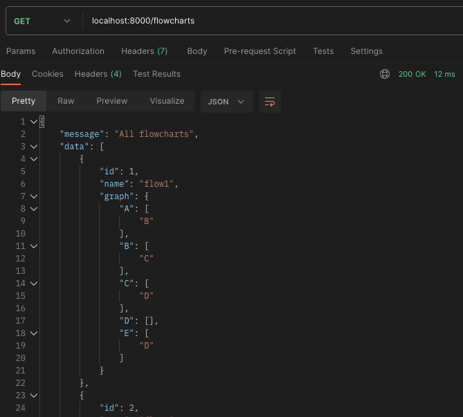

# API Request Reponses : 

## Create a flowchart :
Name : Marketing Flowchart

## Get details of a flowchart

## Get a sneak peak for all flowcharts

## Update a flowchart with new edges 

## Get the outdegree of an edge in a flowchart

##   Delete a flowchart

